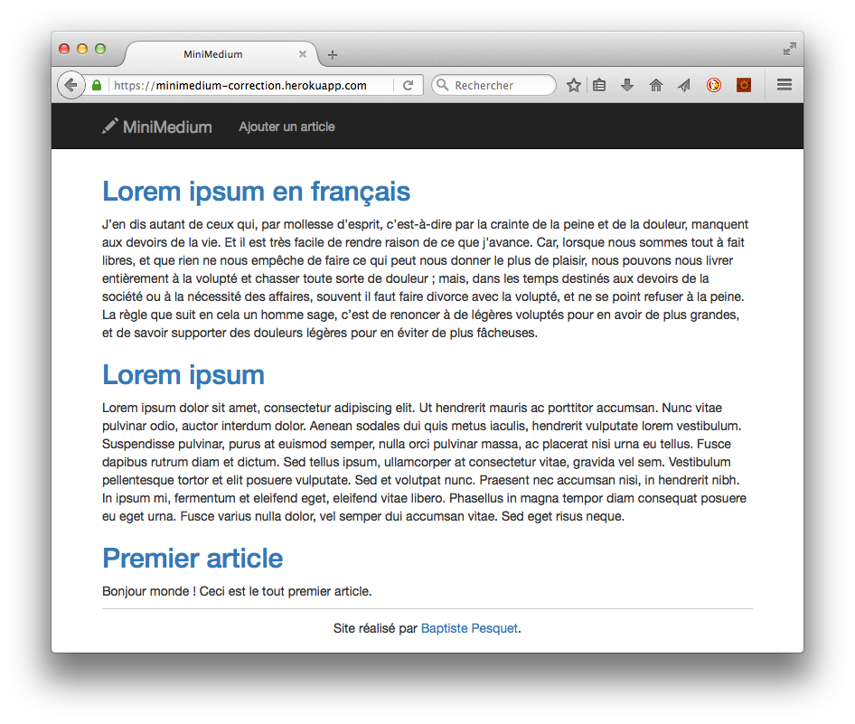

# MiniMedium

Sujet d'examen ISI1-WEB.

## Consignes d'installation

* Accepter [l'invitation Classroom for GitHub](https://classroom.github.com/assignment-invitations/8d66539761d8a385db7f8f631f55053d) afin d'obtenir le dépôt GitHub `minimedium-VotreLogin`.
* Cloner ce dépôt dans le répertoire de travail de votre serveur Web local (exemple : `c:\xampp\htdocs` avec XAMPP pour Windows).

Les scripts de création de la base de données vous sont fournis.

## Consignes de travail

* Coder le projet dans le répertoire où il a été cloné.
* Committer régulièrement puis pousser le code vers le dépôt GitHub `minimedium-VotreLogin`.

## Objectifs

Vous devez réaliser un site Web de type blog. Le résultat demandé est en ligne à l'URL https://minimedium-correction.herokuapp.com/.

Les fonctionnalités à réaliser sont (dans cet ordre) :

1. Page d'accueil affichant la liste des articles du blog.
2. Détails sur un article.
3. Ajout d'un nouvel article.
4. Ajout d'un commentaire à un article.

Ceci fait, d'autres fonctionnalités bonus sont envisageables :

1. Déploiement sur OpenShift (préciser l'URL sur GitHub).
2. Edition d'un article.
3. Authentification utilisateur pour pouvoir ajouter un commentaire.
4. ...

